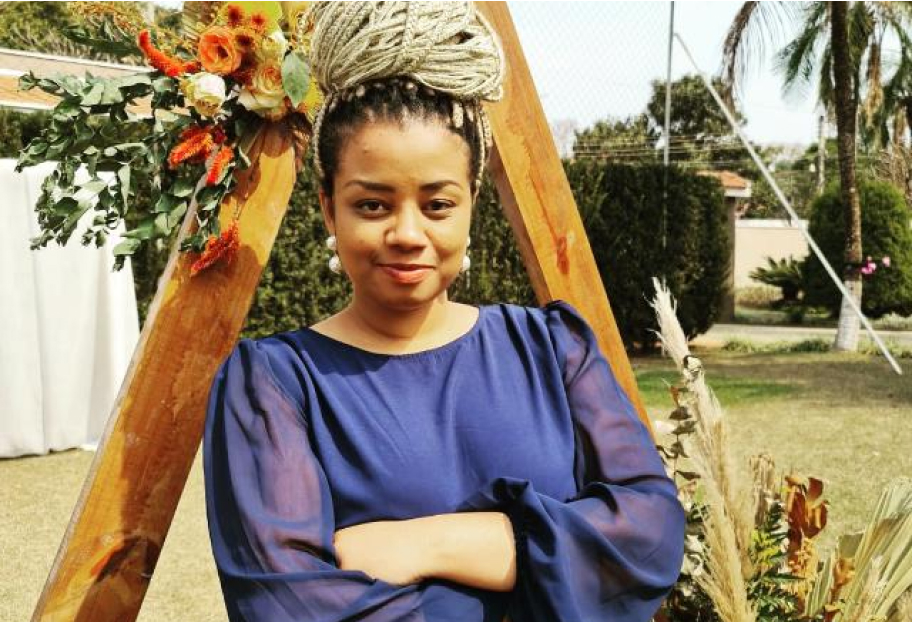

**As Casamenteiras** vencem a categoria **Cerimonialista de Casamentos** da XIII Edição do Prêmio Casamentos 2023, o mais prestigiado do setor casamenteiro.

## 2023 Um Ano Vitorioso - por Priscilla Barbosa

Olá queridas e queridos casais!

Eu, quero começar esse texto agradecendo imensamente a todos vocês que confiaram e nos apoiaram recomendando As Casamenteiras ao longo desse tempo. Nesse 2023 recebemos mais um prêmio e a emoção é indescritível ao saber que a nossa dedicação e trabalho estão sendo reconhecidos no Brasil e no Mundo.

## Prêmio Casamentos Awards 2023

Eu e minha equipe estamos extremamente felizes em anunciar que recebemos o prêmio na **8ª edição dos Casamentos Awards 2023**. Esse prêmio é concedido aos fornecedores mais recomendados do ano pelos casais no site Casamentos.com.br e foi baseado nas avaliações e recomendações de vocês.

Não há palavras para descrever a emoção que estamos sentindo agora. Receber esse prêmio é resultado de muito trabalho, dedicação e amor pelo que fazemos. Nós acreditamos no amor e sabemos que cada casamento é único e especial, e por isso trabalhamos incansavelmente para transformar cada sonho em realidade.

## Esse Prêmio é Nosso!

É realmente um marco para nós e uma grande alegria saber que todo o nosso empenho em oferecer um serviço de qualidade e atenção personalizada foi recompensado.

Mais uma vez, muito obrigada por todo o apoio e recomendação. Nós, da empresa As Casamenteiras, estamos sempre à disposição para ajudar os casais a planejarem o grande dia. Estamos ansiosas para os casamentos desse ano! Nos acompanhe nas redes e no [Instagram](https://instagram.com/ascasamenteiras_)

Com amor,
Priscilla Barbosa e a equipe As Casamenteiras.

## Priscilla Barbosa, A Casamenteira

Quando olhamos para o currículo de **Priscilla Barbosa** vemos o seu diferencial. A sua formação em **Gestão de Negócios pela USP-ESALQ**, com título de **MBA** faz toda a diferença na organização de eventos. Em sua história organizou de forma tranquila dezenas de casamentos, eventos sociais e solenidades públicas.

**Priscilla Barbosa** obteve sucesso como empreendedora e carrega experiências no setor agroecológico (como produtora e distribuidora), comerciante na área de produtos orgânicos de cadeia de suprimento sustentável. Está há mais de uma década na área de eventos. Pri Barbosa teve seu primeiro emprego no INCRA, onde foi continuamente promovida até vir a se tornar chefe de gabinete. Atualmente trabalha como assessora parlamentar na **ALESP**.

## Categoria Cerimonialista de Casamentos

Por que contratar uma assessora de casamento? Qual é a real importância de uma casamenteira?

É comum após o casamento nós, como Equipe d'As Casamenteiras, recebermos testemunhos públicos de gratidão por termos aliviado e assessorado o objetivo do casal e principalmente da noiva, ao promover um evento dessa magnitude e importância.

Nós sabemos como a organização, manutenção e desenvolvimento de um evento pode ser cansativo e até frustrante. Há uma infinidade de problemas fora do nosso alcance que enfrentaremos. Desde uma crise nacional, até mesmo a manutenção do sistema da rede elétrica no dia do casamento. Esses são alguns dos muitos casos inesperados que podem acontecer, além de todos os protocolos.

Assessoria não são só problemas, a escolha de uma assessora experiente em negociações, pode te render até **30% de desconto** no valor dos contratos de todo o casamento. Seria bom ter essa economia? O que o casal faria com o dinheiro que Priscilla Barbosa conseguiria com seu poder de negociação?

## Vencedora do Prêmio Zankyou ZIWA Awards 22/23

2022 foi um ano especial para nós, e agora em 2023 começamos com o pé direito, conquistando mais essa premiação. Estamos animadas para continuar ajudando os casais a realizarem seus sonhos de um casamento perfeito, e sabemos que juntos podemos continuar fazendo acontecer esses dias tão mágicos na vida de vocês e na minha.

## O Serviço Premiado Gestão 360 On-line d'As Casamenteiras

Com a **Gestão 360 On-line** d'As Casamenteiras o casal está completamente amparado.

É com a Gestão 360 que a nossa equipe se destacou entre os fornecedores e nossos clientes. Foi com esse serviço que vencemos o **Prêmio Casamentos Awards 2023** e o**Prêmio Zankyou Internacional Ziwa Awards 2022**.

## Como faço para saber mais sobre esse serviço premiado d'As Casamenteiras?

Para saber mais sobre todos os nossos serviços, sinta-se à vontade em nos enviar a sua pergunta. Entre em contato com a nossa equipe pelo _Whats_ 16 9 9245-2437 ou por [e-mail](mailto:cerimonial@ascasamenteiras.com.br).

Nos siga também no [Instagram](https://instagram.com/ascasamenteiras_).

Visita também a página dos vencedores **ZIWA Awards 2022**, [clicando aqui](https://www.zankyou.com.br/ziwa/assessorias-cerimonial).

Desejamos só o melhor para vocês nesse momento tão especial.

As Casamenteiras - Todo Amor Importa!

**_#bóraCasarMeuPovo_** **_#asCasamenteiras_** **_#casamentoDosSonhos_**
