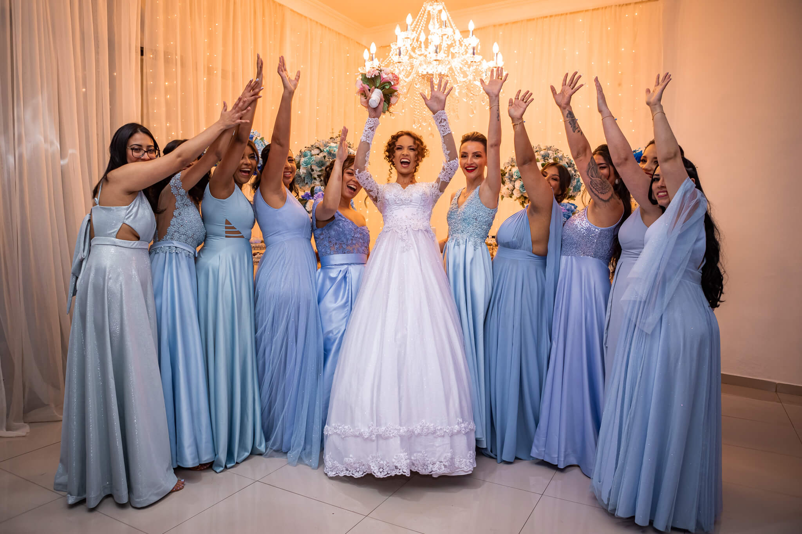

Estamos imensamente animadas e surpresas por termos sidos escolhidas como as melhores Casamenteiras do Estado de São Paulo e do Brasil, nesse badaladíssimo prêmio internacional promovido pela [Zankyou](https://www.zankyou.com.br).

## Prêmio Zankyou ZIWA Awards 2022

Somos as vencedoras na categoria **Cerimonialista de Casamentos** da XII Edição deste que é um dos mais prestigiados prêmios internacionais do setor casamenteiro.

Vencer um prêmio internacional significa para nós uma vitória também de todas As Casamenteiras espalhadas por todo o Brasil, mais uma vez a medalha de ouro é nossa e veio pelas mãos de uma mulher.

## Priscilla Barbosa, A Casamenteira

Quando olhamos para o currículo de **Priscilla Barbosa** vemos o seu diferencial. A sua formação em **Gestão de Negócios pela USP-ESALQ**, com título de **MBA** faz toda a diferença na organização de eventos. Em sua história organizou de forma tranquila dezenas de casamentos, eventos sociais e solenidades públicas.

**Priscilla Barbosa** obteve sucesso como empreendedora e carrega experiências no setor agroecológico (como produtora e distribuidora), comerciante na área de produtos orgânicos de cadeia de suprimento sustentável. Está há mais de uma década na área de eventos. Pri Barbosa teve seu primeiro emprego no INCRA, onde foi continuamente promovida até vir a se tornar chefe de gabinete. Atualmente trabalha como assessora parlamentar na **ALESP**.

## Categoria Cerimonialista de Casamentos

Por que contratar uma assessora de casamento? Qual é a real importância de uma casamenteira?

É comum após o casamento nós, como Equipe d'As Casamenteiras, recebermos testemunhos públicos de gratidão por termos aliviado e assessorado o objetivo do casal e principalmente da noiva, ao promover um evento dessa magnitude e importância.

Nós sabemos como a organização, manutenção e desenvolvimento de um evento pode ser cansativo e até frustrante. Há uma infinidade de problemas fora do nosso alcance que enfrentaremos. Desde uma crise nacional, até mesmo a manutenção do sistema da rede elétrica no dia do casamento. Esses são alguns dos muitos casos inesperados que podem acontecer, além de todos os protocolos.

Assessoria não são só problemas, a escolha de uma assessora experiente em negociações, pode te render até **30% de desconto** no valor dos contratos de todo o casamento. Seria bom ter essa economia? O que o casal faria com o dinheiro que Priscilla Barbosa conseguiria com seu poder de negociação?

## O Serviço Premiado Gestão 360 d'As Casamenteiras

Com a **Gestão 360 d'As Casamenteiras** o casal está completamente amparado. Foi com esse serviço que vencemos o **Prêmio Zankyou Internacional Ziwa Awards 2022**. É com a Gestão 360 que a nossa equipe se destacou entre os fornecedores e nossos clientes.

**O que é uma assessoria completa de casamento?**

Somos as responsáveis por abraçar, entender e resolver objetivos e problemas. Criamos grupo no _whats_ e servimos como facilitadoras entre o casal, seus planos e as possibilidades de fornecedores.

Também disponibilizamos para cada um do casal um acesso ao melhor aplicativo de organização de casamentos do Brasil.

Podemos fazer a **visita técnica especializada** que garante a _profissionalidade_ do casamento. Na visita técnica a Equipe d'As Casamenteiras vai garantir que as escolhas do casal sejam visualizadas no local da cerimônia e festa. É nesse momento onde o plano para cada fornecedor será montado.

Fazemos a orquestração dos profissionais envolvidos de forma colaborativa para que todos possuam o cronograma do evento, com cada especificidade de cada serviço contratado.

Dificuldades certamente virão, mas aqui nAs Casamenteiras nós abraçamos o seu evento de forma alegre, fornecendo somente as melhores energias para esse ambiente sagrado.

Essa é uma jornada que se inicia, por que não caminhamos juntos?

## Como faço para saber mais sobre esse serviço premiado d'As Casamenteiras?

Para saber mais sobre todos os nossos serviços, sinta-se à vontade em nos enviar a sua pergunta. Entre em contato com a nossa equipe pelo _Whats_ 16 9 9245-2437 ou por [e-mail](mailto:cerimonial@ascasamenteiras.com.br).

Nos siga também no [Instagram](https://instagram.com/ascasamenteiras_).

Visita também a página dos vencedores **ZIWA Awards 2022**, [clicando aqui](https://www.zankyou.com.br/ziwa/assessorias-cerimonial).

Desejamos só o melhor para vocês nesse momento tão especial.

As Casamenteiras - Todo Amor Importa!

**_#bóraCasarMeuPovo_** **_#asCasamenteiras_** **_#casamentoDosSonhos_**
