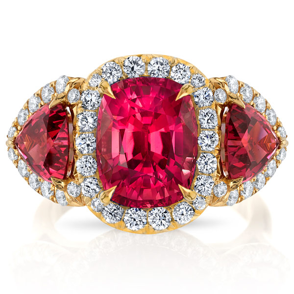
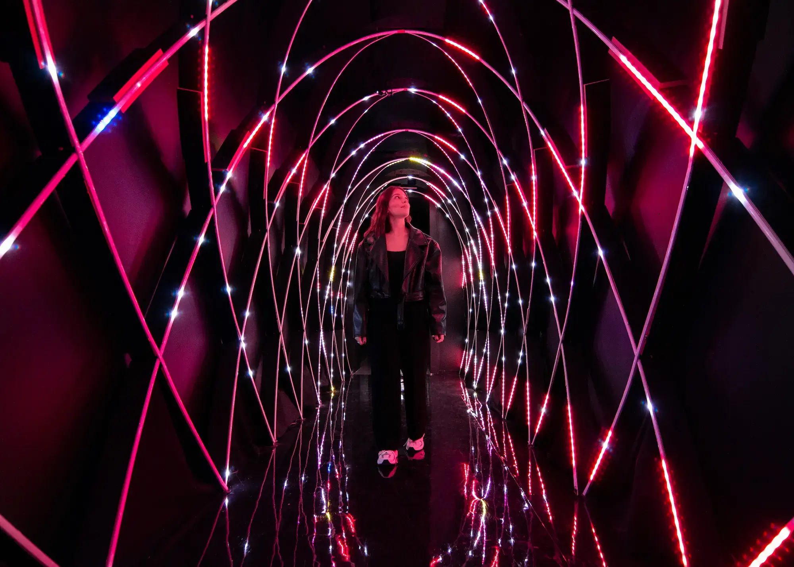
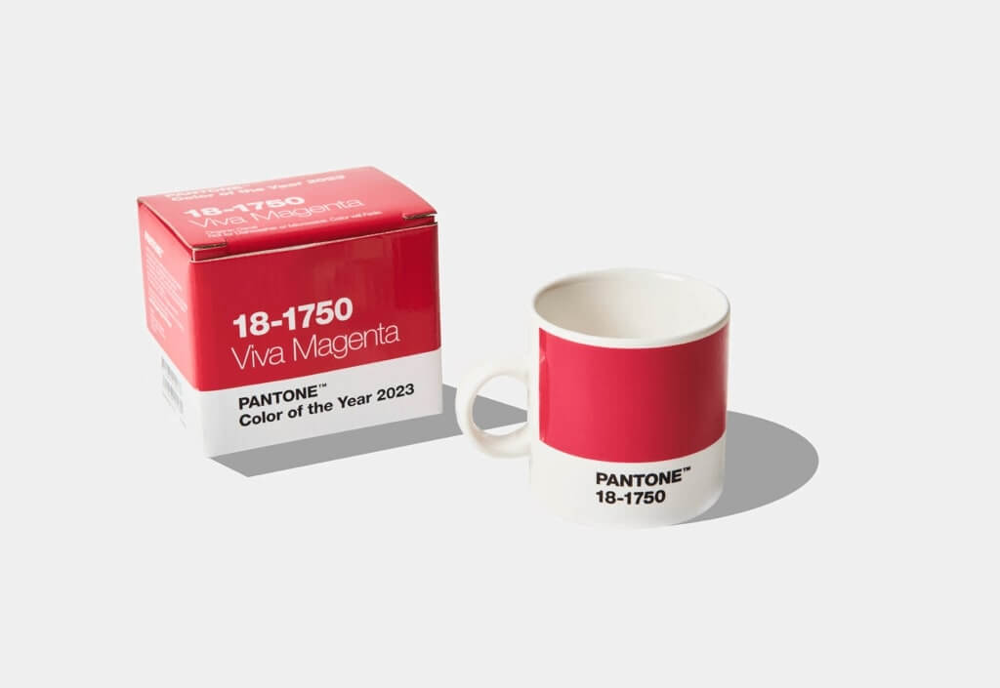
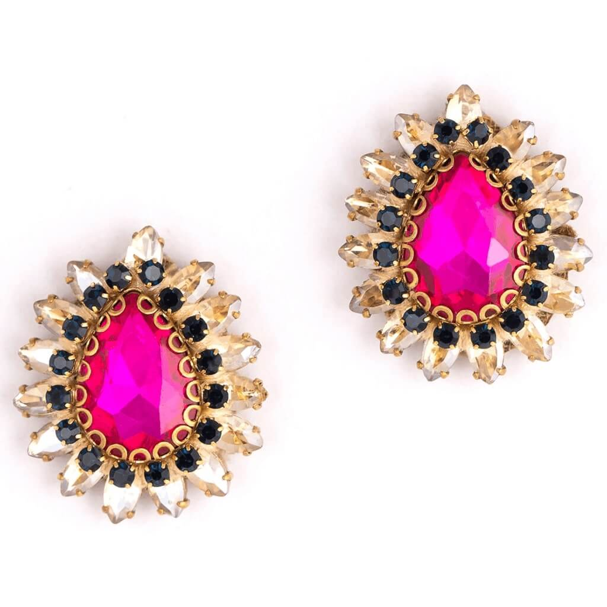
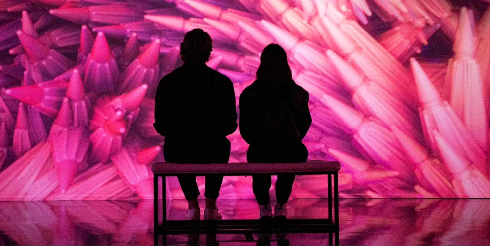

A **Cor Pantone do ano de 2023** foi revelada! Mas não foi somente a Pantone que revelou a sua cor do ano, descobra agora tudo sobre as tendências de cores para o ano de 2023 e planeje o seu casamento com esse universo tão diverso de cores.

Esse é um momento muito importante para todos e nós d'**As Casamenteiras** estávamos ansiosas por essa apresentação; O **Pantone Color Institute** (Instituto Cor Pantone) acaba de fazer o anúncio oficial de que a Cor Pantone do ano de 2023 será o **Viva Magenta**.

## Vibrante Com Vigor

Pronto para pensar no seu casamento com a cor Pantone de 2023? Foi pensando nos casamentos de 2023 que nós d'As Casamenteiras preparamos aqui tudo o que você precisa saber sobre o Viva Magenta e como usar essa cor para inspirar o seu casamento.

## Viva Magenta, A Cor do Ano de 2023

A Pantone apresenta a cor Viva Magenta como sendo a cor do ano de 2023, uma cor "vibrante com vigor".

### Em 2023 a cor do ano é o vermelho?

O Viva Magenta é um tom natural da **família do vermelho** e demonstra um novo sinal de força. Exatamente a mensagem que nós precisamos no final deste ano.

Viva Magenta não é um pink, nem é um rosa bebê. É uma variação do carmesim – descrito pela Pantone como “um vermelho não convencional para um momento não convencional”. Apresenta ao mundo o que a Pantone define como “O Magentaverso”, uma referência ao Metaverso de Mark Zuckerberg e uma cor que abrange os ambientes digital e físico.

Para uso virtual sua nomemclatura hexadecimal é #BB2649. Já para o uso em impressõs: CMYK (0%, 80%, 61%, 27%).

## A cochonilha, o inseto que inspira e promove uma reflexão

Como variação do carmesim (vermelho profundo), a cor Viva Magenta tem essa particular realação com um inseto de nome **Cochonilha**.

A cochonilha é um minúsculo inseto, um besouro de no máximo meia polegada. A conchonilha é encontrada nas terras altas da Armênia. O inseto existe há milênios como fonte de ácido carmínico e é amplamente usado na produção dessa cor extremamente popular entre as pinturas, tapetes e ornamentos de todos os milênios.

## PANTONE 18-1750 Viva Magenta

_PANTONE 18-1750 Viva Magenta_ escreve uma nova narrativa. Corajosa e destemida, uma cor pulsante cuja exuberância promove otimismo e alegria. Poderoso e fortalecedor, é um vermelho animado que encoraja a experimentação e a auto-expressão sem restrições, um tom eletrizante e sem limites que está manifestamente “lá fora” e é uma declaração de destaque. Audacioso, espirituoso e inclusivo para todos, PANTONE 18-1750 Viva Magenta dá as boas-vindas a todos e a todos com o mesmo espírito rebelde.

Um tom vermelho carmesim matizado que apresenta um equilíbrio entre quente e frio, PANTONE 18-1750 Viva Magenta também é uma cor híbrida, que confortavelmente se estende entre o físico e o virtual, evocando nosso mundo multidimensional. Assertivo, mas não agressivo, é um vermelho carmim que não domina com ousadia, mas adota uma abordagem de “punho em luva de veludo”. Exalando dinamismo, PANTONE 18-1750 Viva Magenta é um tom vermelho transformador capaz de conduzir o design para criar um futuro mais positivo.”

De acordo com a diretora executiva do Pantone Color Institute, Leatrice Eiseman, já era hora de uma cor vermelha do ano novamente. O vermelho está, sem dúvida, fazendo sucesso no mundo da moda, com designers de Tom Ford a Roksanda apresentando tons de vermelho na passarela, incluindo magenta.

Para começar a incorporar esta nova e excitante tonalidade Pantone em seus designs ou projetos criativos, confira nossa Coleção Viva Magenta no Envato Elements.

## Magentaverso

> Cor! Que linguagem profunda e misteriosa, a linguagem dos sonhos. - Eugène-Henri-Paul Gauguin - pintor francês do pós-impressionismo.

O Magentaverso é a paleta de cores que tem como a cor principal o Viva Magenta.

O Magentaverso é o universo ficcional onde tudo é vibrante. Esse é um conceito que pode ser aplicado de ponta a ponta no seu casamento, inclusive com ajuda das visitas técnicas, para que ninguém fique inseguro na hora da cerimônia.

Abaixo listamos as cores do Magentaverso:

- Corniso pálido (Pale Dogwood - #EDCDC2);
- Areia cinza (Gray Sand - #E5CCAF);
- Pleno ar (Plein Air - #BFCAD6);
- Cinza ágata (Agate Gray - #B3B1A1);
- Cáqui pálido (Pale Khaki - #BFAF92);
- Campos de centeio (Fields of Rye - #B7A990);
- Lilás cinza (Gray Lilac - #D4CACD).

Não só presente no mundo real, saltando aos nossos olhos, com a presença do Viva Magenta, a Pantone celebra nossa transição gradual para a realidade virtual, que se reflete na apresentação não convencional deste ano da _cor do ano de 2023_.

Os últimos anos foram transformadores em muitos aspectos. Como resultado, foi criado um espaço onde somos livres para explorar e ser aceitos exatamente por quem sentimos que somos, seja em um universo cibernético, um espaço convencional ou uma mistura mágica de ambos. Estamos criando um mundo dinâmico que incentiva a experimentação, que aproveita o virtual dentro do reino físico e encoraja nossa força e espírito para explorar possibilidades inovadoras.

> “Aproveitando o espírito experimental do Viva Magenta, a Pantone explora a dinâmica entre a Inteligência Artificial e a criatividade humana para criar o “The Magentaverse” disponível ao público pela primeira vez.” - Laurie Pressman, vice-presidente do Pantone Color Institute

## Cores decorativas para 2023 - Heubach

Assim como a empresa Pantone, a Heubach trabalha com pigmentos e tem a sua própria versão das tendências de cores para 2023. E eles apostam em um azul chamado: O **Azul Bom Gênio** (Good Jinn).

Que casal que não gostaria de ter um gênio para realizar todos os desejos do seu casamento? Ou responder todas as nossas dúvidas em relação ao mundo?

A tonalidade azul muito escura e intensa é como as coordenadas de uma estrela distante ou de um tesouro afundado. É ótimo para enaltecer no contraste determinados objetos e coisas. Assim como o gênio ou a ciência moderna, ressalta as respostas às nossas perguntas.

Peças centrais ficam particularmente bem quando todo o seu arredor é preenchido com este novo azul - criando um espaço envolvente profundo para melhor admiração e respeito.

## Vining Ivy, A Cor PPG do Ano 2023

Já para a empresa PPG a cor do ano é o Vining Ivy, um verde-azulado. Sabe aquele famoso azul/verde que costumamos de chamar de azul petróleo? É uma variação dessa cor.

Ao contrário da Pantone que busca a ousadia de quem quer viver intensamente após esse grave período da saúde global, a PPG, por meio do seu diretor Marcelo Diniz afirma:

> Os consumidores estão buscando simplicidade no pós-covid, o que significa viver e valorizar momentos especiais. A Vining Ivy se incorpora perfeitamente nessa vibe, por ser uma cor ousada e ao mesmo tempo calmante que, com sua versatilidade, possibilita que que os consumidores vivam suas melhores lembranças." Marcelo Diniz, diretor de negócios arquitetônicos - PPG América do Sul.

## Lavanda Digital, A Cor do Ano 2023 pela Coloro + WGSN

O roxo, na cor **Digital Lavender** é uma cor-chave de 2023, representando bem-estar e a desaturação. Revigorar o espírito se tornará prioridade para os consumidores que desejam proteger e fortalecer sua saúde mental.

O Lavanda Digital (Digital Lavender) vai se conectar com esse foco no bem-estar, oferecendo uma sensação de estabilidade e equilíbrio. Pesquisas indicam que cores com menores comprimentos de onda, como o Lavanda Digital, evocam calma e serenidade. Já inserida na cultura digital, essa cor deverá permitir a convergência entre os mundos físico e virtual.

O Lavanda Digital é uma cor gênero-inclusiva já estabelecida no mercado jovem e espera-se que isso se amplie para todas as categorias de moda em 2023. O aspecto sinestésico desta cor a torna ideal para rituais de autocuidado, práticas terapêuticas e produtos de bem-estar. Esse tom de roxo também será essencial para eletrônicos, bem-estar digital, iluminação voltada para a qualidade de vida e artigos para a casa.

### Sobre a WGSN

A WGSN é a autoridade global em tendências de consumo e design, ajudando marcas de todo o mundo a criar os produtos certos no momento certo para o consumidor de amanhã.

As previsões confiáveis de consumo e design da WGSN potencializam o excelente design de produtos, permitindo que seus clientes criem um futuro melhor. Seus serviços abrangem percepções do consumidor, moda, beleza, interiores, estilo de vida, previsão de alimentos e bebidas, análise de dados e consultoria especializada.

### Sobre a Coloro

A Coloro decodificou as cores de como o olho humano vê. Combinando 20 anos de pesquisa científica com uma metodologia de cores de 100 anos, a Coloro criou um sistema de cores verdadeiramente intuitivo.

Para a empresa é importante que você selecione as cores certas, validadas com a experiência em tendências da WGSN, e obtenha-as com precisão a sua cor.

## Como faço para saber mais sobre os serviços premiados d'As Casamenteiras?

Para saber mais sobre todos os nossos serviços, sinta-se à vontade em nos enviar a sua pergunta. Entre em contato com a nossa equipe pelo _Whats_ 16 9 9245-2437 ou por [e-mail](mailto:cerimonial@ascasamenteiras.com.br).

Nos siga também no [Instagram](https://instagram.com/ascasamenteiras_).

Visita também a página do nosso **Prêmio Internacional ZIWA Awards 2022**, [clicando aqui](/vencemos-premio-zankyou-2022/).

Desejamos só o melhor para vocês nesse momento tão especial.

As Casamenteiras - Todo Amor Importa!

**_#bóraCasarMeuPovo_** **_#asCasamenteiras_** **_#casamentoDosSonhos_**
